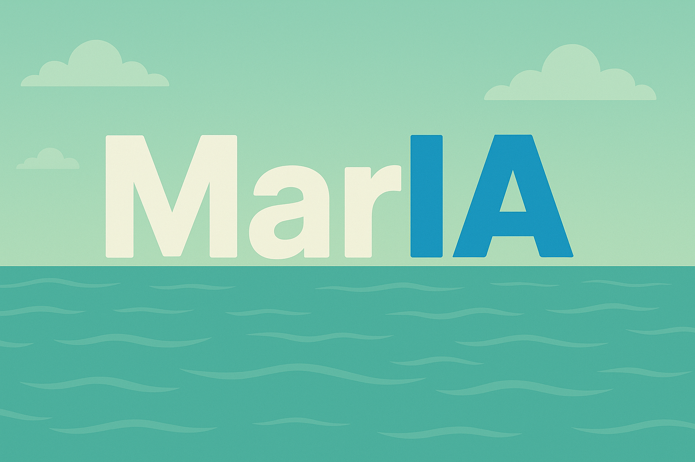

# MarIA - Asistente de Salud Mental basado en IA

<div align="center">
  
  <br>
  <strong>Un compañero de salud mental potenciado por inteligencia artificial</strong>
  <br><br>
  <a href="https://ai-mental-health-zyb6.onrender.com" target="_blank">Ver Demo en Vivo</a>
</div>

## 📖 Introducción

MarIA es un **chatbot de salud mental** impulsado por inteligencia artificial que integra **Next.js**, **TypeScript**, y las APIs más avanzadas para ofrecer soporte emocional y técnicas de relajación personalizadas en tiempo real. Diseñado para brindar empatía, guías de mindfulness y análisis de voz, MarIA acompaña a los usuarios en momentos de ansiedad, estrés o para fomentar su bienestar mental general.

## 🔍 Características principales

- **Chat terapéutico**: Respuestas empáticas generadas por GPT-4.1-mini para sostener conversaciones profundas y seguras
- **Técnicas de relajación**: Guías de respiración y mindfulness adaptadas al usuario
- **Análisis de voz y emociones**: Procesamiento de audio con Deepgram Nova-2 para identificar tono, sentimientos y patrones emocionales
- **Comunicación en tiempo real**: Integración con LiveKit para chat de voz y texto sin latencia perceptible
- **Historial de sesiones**: Registro seguro de conversaciones y recomendaciones en PostgreSQL mediante Prisma
- **TTS y STT**: Conversión de texto a voz (GPT-4o-mini-tts) y voz a texto (Deepgram Nova-2) para una experiencia más natural
- **Autenticación segura**: Integración con Google OAuth y NextAuth para proteger los datos de los usuarios

## 🚀 Tecnologías

- **Frontend**: 
  - Next.js (App Router)
  - TypeScript
  - Tailwind CSS + shadcn/ui
  - React

- **Backend**:
  - Prisma ORM
  - Supabase + PostgreSQL
  - NextAuth.js
  - Node.js

- **IA y APIs**:
  - OpenAI API
    - GPT-4.1-mini-2025-04-14 (para conversaciones principales)
    - GPT-3.5-turbo (para historial de conversaciones)
    - GPT-4o-mini-tts (para texto a voz)
  - Deepgram Nova-2 (para reconocimiento de voz y análisis emocional)
  - LiveKit (comunicación en tiempo real)
  - Google OAuth (autenticación)

- **Despliegue**:
  - Render.com

## 🛠️ Instalación

1. **Clona el repositorio**:
   ```bash
   git clone https://github.com/Nico2603/MarIA.git
   cd MarIA
   ```

2. **Instala dependencias**:
   ```bash
   npm install
   ```

3. **Configura variables de entorno**:
   Crea un archivo `.env.local` con las siguientes variables:
   ```env
   # Servidor
   PORT=3000
   
   # Base de datos (Supabase)
   DATABASE_URL="postgresql://..."
   NEXT_PUBLIC_SUPABASE_URL=
   NEXT_PUBLIC_SUPABASE_ANON_KEY=
   
   # LiveKit
   LIVEKIT_API_KEY=
   LIVEKIT_API_SECRET=
   LIVEKIT_URL=
   NEXT_PUBLIC_LIVEKIT_URL=
   
   # OpenAI
   OPENAI_API_KEY=
   
   # Autenticación
   GOOGLE_CLIENT_ID=
   GOOGLE_CLIENT_SECRET=
   NEXTAUTH_SECRET=
   NEXTAUTH_URL=http://localhost:3000
   ```

4. **Configura Prisma**:
   ```bash
   npx prisma generate
   npx prisma db push
   ```

5. **Ejecuta en desarrollo**:
   ```bash
   npm run dev
   ```

## 🚀 Despliegue en Render

### Configuración automática con render.yaml

El proyecto incluye un archivo `render.yaml` para despliegue automático:

```yaml
services:
  - type: web
    name: maria-frontend
    runtime: node
    buildCommand: |
      npm ci &&
      npx prisma generate &&
      npm run build
    startCommand: npm start
    plan: starter
    healthCheckPath: /api/health
    envVars:
      - key: NODE_ENV
        value: production
      - key: PRISMA_CLI_BINARY_TARGETS
        value: native,rhel-openssl-3.0.x
      - key: DATABASE_URL
        fromDatabase:
          name: maria-db
          property: connectionString
```

### Variables de entorno requeridas en Render

Configura estas variables en el dashboard de Render:

**Variables obligatorias:**
- `DATABASE_URL`: URL de conexión a PostgreSQL
- `NEXTAUTH_URL`: URL de tu aplicación en Render (ej: https://tu-app.onrender.com)
- `NEXTAUTH_SECRET`: Clave secreta para NextAuth (genera una aleatoria)
- `NODE_ENV`: `production`

**Variables para funcionalidades específicas:**
- `GOOGLE_CLIENT_ID`: ID del cliente de Google OAuth
- `GOOGLE_CLIENT_SECRET`: Secreto del cliente de Google OAuth
- `OPENAI_API_KEY`: Clave de API de OpenAI
- `LIVEKIT_API_KEY`: Clave de API de LiveKit
- `LIVEKIT_API_SECRET`: Secreto de API de LiveKit
- `LIVEKIT_URL`: URL del servidor LiveKit

**Variables técnicas (opcionales):**
- `PRISMA_CLI_BINARY_TARGETS`: `native,rhel-openssl-3.0.x`

### Solución de problemas comunes

#### ✅ Error SOLUCIONADO: ENOENT wasm-engine-edge.js

Este error se ha resuelto con las siguientes configuraciones incluidas:

1. **Schema de Prisma actualizado** con binary targets correctos
2. **Configuración simplificada** sin engineType y output personalizado
3. **Scripts de build optimizados** con prebuild y postbuild
4. **Configuración de Next.js** con serverComponentsExternalPackages
5. **Soporte multi-plataforma** (Windows para desarrollo, Linux para producción)

#### ✅ Error SOLUCIONADO: OpenSSL 1.x deprecated

Actualizado a OpenSSL 3.x:
- Binary targets actualizados a `rhel-openssl-3.0.x`
- Variables de entorno configuradas correctamente

#### Pasos de troubleshooting adicionales:

1. **Verifica variables de entorno**: Asegúrate de que todas las variables obligatorias estén configuradas
2. **Versión de Node.js**: Usa Node.js 20.11.0 (especificado en `.nvmrc`)
3. **Logs de build**: Revisa los logs de build en Render para errores específicos
4. **Base de datos**: Verifica que la base de datos esté accesible y la URL sea correcta
5. **Health check**: El endpoint `/api/health` debe responder correctamente

#### Comandos útiles para debugging:

```bash
# Regenerar cliente de Prisma
npx prisma generate

# Verificar build local
npm run build

# Verificar conexión a BD
npx prisma db pull
```

### Proceso de despliegue

1. **Pushea los cambios**:
   ```bash
   git add .
   git commit -m "feat: configurar para despliegue en Render"
   git push origin main
   ```

2. **Configura variables en Render**:
   - Ve a tu dashboard de Render
   - Añade las variables de entorno necesarias
   - Asegúrate de que `DATABASE_URL` apunte a tu base de datos

3. **Despliega**:
   - Render detectará automáticamente el `render.yaml`
   - El build se ejecutará automáticamente
   - El health check verificará que la app esté funcionando

## 📄 Licencia

Este proyecto está bajo la Licencia ISC. Ver el archivo `LICENSE` para más detalles.

## 🤝 Contribuir

Las contribuciones son bienvenidas. Por favor:

1. Fork el proyecto
2. Crea una rama para tu feature (`git checkout -b feature/AmazingFeature`)
3. Commit tus cambios (`git commit -m 'Add some AmazingFeature'`)
4. Push a la rama (`git push origin feature/AmazingFeature`)
5. Abre un Pull Request

## 👥 Contacto

**Proyecto Link**: [https://github.com/Nico2603/MarIA](https://github.com/Nico2603/MarIA)

**Demo en vivo**: [https://ai-mental-health-zyb6.onrender.com](https://ai-mental-health-zyb6.onrender.com) 