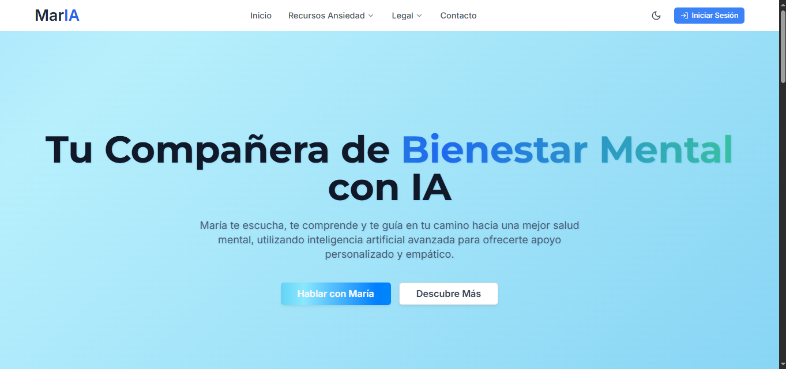
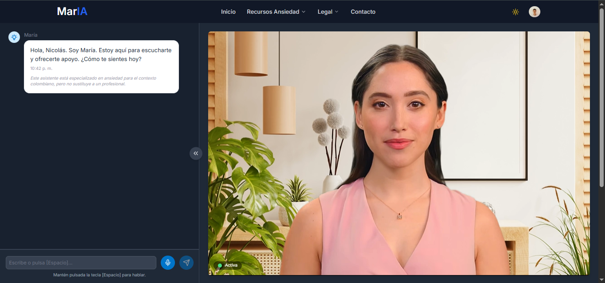
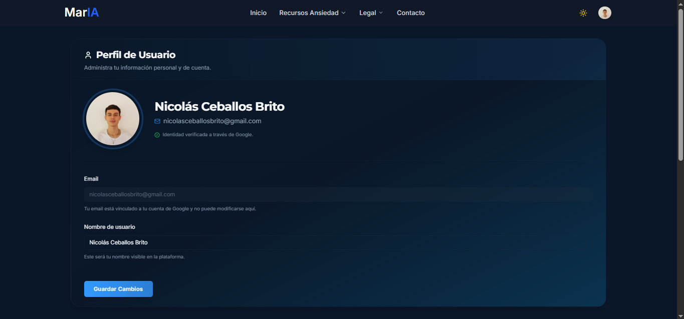

# MarIA - Asistente de Salud Mental basado en IA

<div align="center">
  
  <br>
  <strong>Un compañero de salud mental potenciado por inteligencia artificial</strong>
  <br><br>
  <a href="https://ai-mental-health-zyb6.onrender.com" target="_blank">Ver Demo en Vivo</a>
</div>

## 📖 Introducción

MarIA es un **chatbot de salud mental** impulsado por inteligencia artificial que integra **Next.js**, **TypeScript**, y las APIs más avanzadas para ofrecer soporte emocional y técnicas de relajación personalizadas en tiempo real. Diseñado para brindar empatía, guías de mindfulness y análisis de voz, MarIA acompaña a los usuarios en momentos de ansiedad, estrés o para fomentar su bienestar mental general.

[](https://www.teilur.ai/)

## 🔍 Características principales

- **Chat terapéutico**: Respuestas empáticas generadas por GPT-4.1-mini para sostener conversaciones profundas y seguras
- **Técnicas de relajación**: Guías de respiración y mindfulness adaptadas al usuario
- **Análisis de voz y emociones**: Procesamiento de audio con Deepgram Nova-2 para identificar tono, sentimientos y patrones emocionales
- **Comunicación en tiempo real**: Integración con LiveKit para chat de voz y texto sin latencia perceptible
- **Historial de sesiones**: Registro seguro de conversaciones y recomendaciones en PostgreSQL mediante Prisma
- **TTS y STT**: Conversión de texto a voz (GPT-4o-mini-tts) y voz a texto (Deepgram Nova-2) para una experiencia más natural
- **Autenticación segura**: Integración con Google OAuth y NextAuth para proteger los datos de los usuarios

## 📸 Capturas de pantalla

<div align="center">
  <table>
    <tr>
      <td align="center"><strong>Landing Page</strong></td>
      <td align="center"><strong>Chat Principal</strong></td>
    </tr>
    <tr>
      <td></td>
      <td></td>
    </tr>
    <tr>
      <td align="center"><strong>Perfiles de Usuario</strong></td>
      <td align="center"><strong>Funcionalidades</strong></td>
    </tr>
    <tr>
      <td></td>
      <td></td>
    </tr>
  </table>
</div>

## 🚀 Tecnologías

- **Frontend**: 
  - Next.js (App Router)
  - TypeScript
  - Tailwind CSS + shadcn/ui
  - React

- **Backend**:
  - Prisma ORM
  - Supabase + PostgreSQL
  - NextAuth.js
  - Node.js

- **IA y APIs**:
  - OpenAI API
    - GPT-4.1-mini-2025-04-14 (para conversaciones principales)
    - GPT-3.5-turbo (para historial de conversaciones)
    - GPT-4o-mini-tts (para texto a voz)
  - Deepgram Nova-2 (para reconocimiento de voz y análisis emocional)
  - LiveKit (comunicación en tiempo real)
  - Google OAuth (autenticación)

- **Despliegue**:
  - Render.com

## 📂 Estructura del proyecto

```bash
AI-Mental-Health/
│
├── README.md
├── next.config.js
├── tailwind.config.js
├── package-lock.json
├── package.json
├── components.json
├── .gitignore
├── prompt.txt
├── next-env.d.ts
├── tsconfig.json
├── postcss.config.js
│
├── .git/
├── .vscode/
├── .cursor/
│
├── public/
│   ├── favicon.ico
│   ├── img/
│   │   ├── teilur-banner.png
│   │   ├── MarIA.png
│   │   ├── chatbot.png
│   │   ├── profiles.png
│   │   └── landingpage.png
│   ├── assets/
│   │   ├── main.js
│   │   └── main.css
│   ├── videos/
│   │   ├── voz.mp4
│   │   └── mute.mp4
│   ├── scripts/
│   └── styles/
│
├── prisma/
│   ├── schema.prisma
│   ├── migrations/
│   │   ├── migration_lock.toml
│   │   ├── 20250430063310_rename_session_to_chatsession/
│   │   ├── 20250430054609_add_nextauth_models/
│   │   └── 20250430040007_init/
│
├── types/
│   └── next-auth.d.ts
│
├── src/
    ├── middleware.ts
    ├── lib/
    │   ├── auth.ts
    │   ├── utils.ts
    │   └── prisma.ts
    ├── types/
    │   └── profile.ts
    ├── app/
        ├── globals.css
        ├── page.tsx
        ├── layout.tsx
        ├── api/
        │   ├── sessions/
        │   ├── chat-sessions/
        │   ├── messages/
        │   ├── summarize/
        │   ├── profile/
        │   ├── auth/
        │   ├── tts/
        │   ├── openai/
        │   ├── audio/
        │   ├── stt/
        │   └── livekit-token/
        ├── dashboard/
        ├── chat/
        ├── consejos/
        ├── contacto/
        ├── legal/
        │   ├── limitaciones/
        │   ├── aviso-legal/
        │   ├── cookies/
        │   ├── privacidad/
        │   └── terminos/
        ├── recursos/
        │   ├── page.tsx
        │   ├── profesionales/
        │   ├── crisis/
        │   ├── tecnicas/
        │   └── ansiedad/
        └── settings/
            └── profile/
```

## 🛠️ Instalación

1. **Clona el repositorio**:
   ```bash
   git clone https://github.com/Nico2603/MarIA.git
   cd MarIA
   ```

2. **Instala dependencias**:
   ```bash
   npm install
   ```

3. **Configura variables de entorno**:
   Crea un archivo `.env.local` con las siguientes variables:
   ```env
   # Servidor
   PORT=3000
   
   # Base de datos (Supabase)
   DATABASE_URL="postgresql://..."
   NEXT_PUBLIC_SUPABASE_URL=
   NEXT_PUBLIC_SUPABASE_ANON_KEY=
   
   # LiveKit
   LIVEKIT_API_KEY=
   LIVEKIT_API_SECRET=
   LIVEKIT_URL=
   NEXT_PUBLIC_LIVEKIT_URL=
   
   # OpenAI
   OPENAI_API_KEY=
   OPENAI_MODEL=gpt-4.1-mini-2025-04-14
   OPENAI_HISTORY_MODEL=gpt-3.5-turbo
   OPENAI_TTS_MODEL=gpt-4o-mini-tts
   
   # Deepgram
   DEEPGRAM_API_KEY=
   DEEPGRAM_MODEL=nova-2
   
   # Autenticación
   GOOGLE_CLIENT_ID=
   GOOGLE_CLIENT_SECRET=
   NEXTAUTH_SECRET=
   NEXTAUTH_URL=
   ```

4. **Aplica migraciones de Prisma**:
   ```bash
   npx prisma migrate dev --name init
   ```

5. **Genera el cliente Prisma**:
   ```bash
   npx prisma generate
   ```

## ▶️ Uso en desarrollo

Inicia el servidor de desarrollo:
```bash
npm run dev
```
Luego, navega a `http://localhost:3000` para ver la aplicación.

## 🚀 Despliegue en producción

1. **Construye la aplicación**:
   ```bash
   npm run build
   ```

2. **Inicia el servidor**:
   ```bash
   npm run start
   ```

La aplicación está actualmente desplegada en: [https://ai-mental-health-zyb6.onrender.com](https://ai-mental-health-zyb6.onrender.com)

## 📄 Licencia

Este proyecto está licenciado bajo © [Teilur, Inc.](https://www.teilur.ai/)

---

<div align="center">
  <p>Desarrollado con ❤️ por <a href="https://github.com/Nico2603">Nico2603</a></p>
  <p>© 2025 Teilur, Inc. Todos los derechos reservados</p