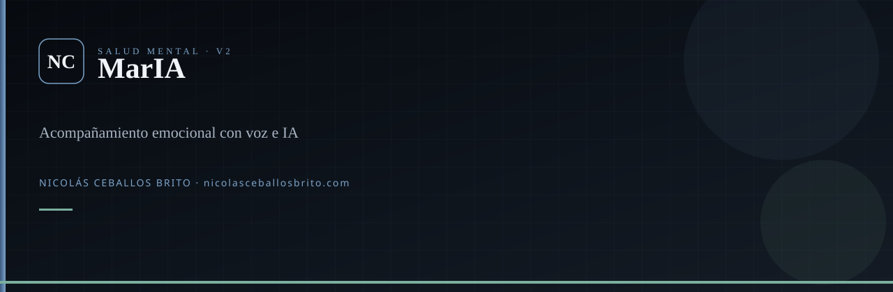
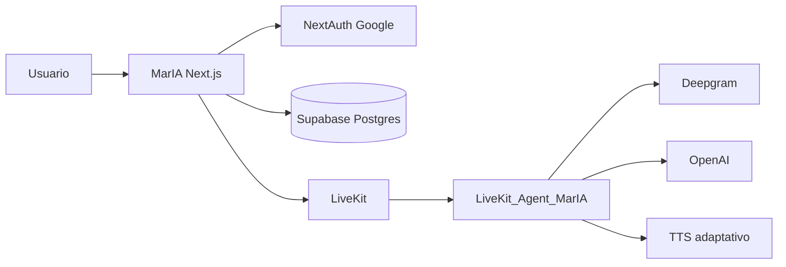

<div align="center">
  
</div>

<br />

<div align="center">

**Compañero de acompañamiento emocional** — voz, texto e historial de sesión.

[](https://ai-mental-health-zyb6.onrender.com)
[](https://nextjs.org/)
[](https://www.typescriptlang.org/)

v2 de la línea de salud mental. La v1 es el [chatbot BERT](https://github.com/Nico2603/ChatBot-MentalHealth-BERT). La voz vive en [LiveKit_Agent_MarIA](https://github.com/Nico2603/LiveKit_Agent_MarIA).

</div>

## Qué es

MarIA sostiene conversaciones de apoyo (ansiedad, estrés, mindfulness) con un backend multi-usuario: OAuth, cuotas, historial en PostgreSQL y un agente de voz en un repo hermano. No sustituye atención clínica.

## Qué hace el código

- Chat empático (OpenAI) + TTS/STT (GPT-4o-mini-tts, Deepgram Nova-2)
- Voz en tiempo real vía **LiveKit** (token API + UI push-to-talk)
- Auth Google (NextAuth) y sesiones Prisma (`User`, `ChatSession`, `Message`)
- Rate limit por usuario en middleware; `/api/health` para Render
- Páginas de recursos (`/recursos/ansiedad`, `/crisis`, …)
- Avatar / eventos Tavus en el canal de datos


```mermaid
flowchart LR
  user[Usuario] --> web[MarIA Next.js]
  web --> auth[NextAuth Google]
  web --> db[(Supabase Postgres)]
  web --> lk[LiveKit]
  lk --> agent[LiveKit_Agent_MarIA]
  agent --> stt[Deepgram]
  agent --> llm[OpenAI]
  agent --> tts[TTS adaptativo]
```

## Stack

Next.js 14 (App Router) · TypeScript · Tailwind + shadcn/Radix · Prisma · PostgreSQL (Supabase) · NextAuth · LiveKit · OpenAI · Deepgram · deploy en [Render](https://ai-mental-health-zyb6.onrender.com)

## Arranque

```bash
git clone https://github.com/Nico2603/MarIA.git
cd MarIA
npm install
```

Copia `.env.local` con `DATABASE_URL`, claves Supabase, LiveKit, OpenAI, Deepgram y NextAuth. Luego `npx prisma generate && npx prisma db push` y `npm run dev`.

El agente de voz se corre aparte: [LiveKit_Agent_MarIA](https://github.com/Nico2603/LiveKit_Agent_MarIA).

## Honestidad

El modo voz puede dejar el chat de texto en segundo plano (hay una nota larga al final del código). El admin de métricas no es un RBAC completo. Es un producto de portafolio / SaaS de estudio, no un dispositivo médico.

## Familia

| Repo | Rol |
|---|---|
| [ChatBot-MentalHealth-BERT](https://github.com/Nico2603/ChatBot-MentalHealth-BERT) | v1 — modelo propio, Flask |
| **MarIA** | v2 — orquestación y UI |
| [LiveKit_Agent_MarIA](https://github.com/Nico2603/LiveKit_Agent_MarIA) | Agente de voz Python |

## Agentes

Skills en `.agents/skills/` (Superpowers, `nicolas-identity`, `find-skills`, `frontend-design`, `react-typescript`). Grafo: `graphify update .`

---

<div align="center">

**Nicolás Ceballos Brito** · Ingeniero en Sistemas y Telecomunicaciones (UCP 2025)  
CTO · Prosavis · Pereira, Colombia

[nicolasceballosbrito.com](https://nicolasceballosbrito.com)
·
[GitHub](https://github.com/Nico2603)
·
[LinkedIn](https://www.linkedin.com/in/nicolas-ceballos-brito/)
·
[X](https://x.com/NicolasCBrito)
·
[Instagram](https://www.instagram.com/nico_ceballos26/)
·
[Hugging Face](https://huggingface.co/Flackoooo)
·
[Email](mailto:nicolasceballosbrito@gmail.com)

</div>
